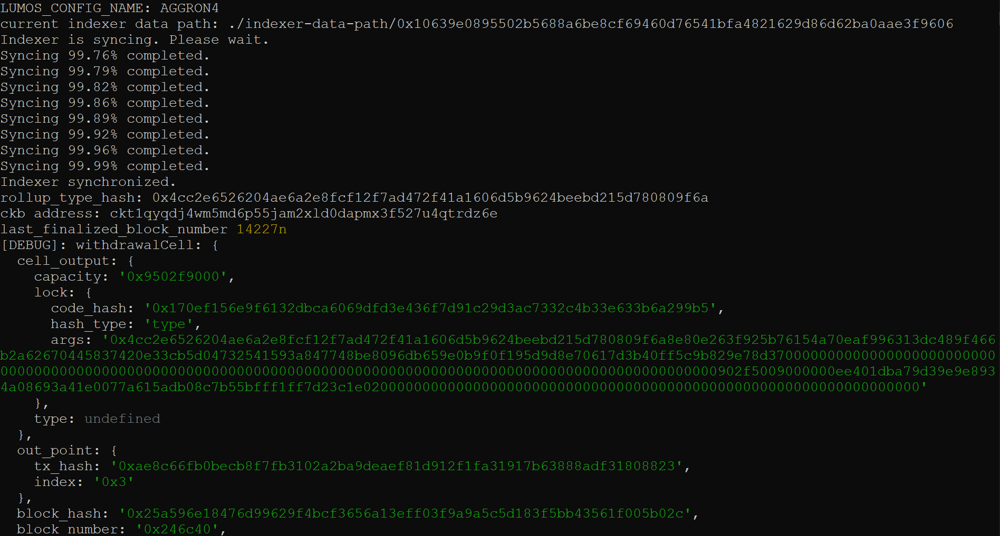
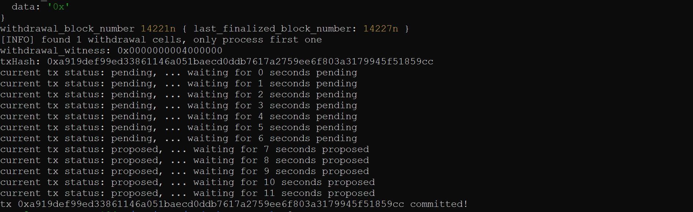

# Gitcoin: 10) Complete Withdrawal Process By Unlocking The Funds

## 1. A screenshot of the console output immediately after running the "unlock" command.

## 2. The Ethereum address that you've used for your Layer 2 account (in text format).

   <b>0x09F7494A5A26623d421bdC88f58887eE1efC7b6c</b>   

## 3. The Nervos Layer 1 address associated with the private key passed to "unlock" command (in text format). This is "ckb address" in the console output.

  <b>ckt1qyqdj4wm5md6p55jam2xld0dapmx3f527u4qtrdz6e</b>   
