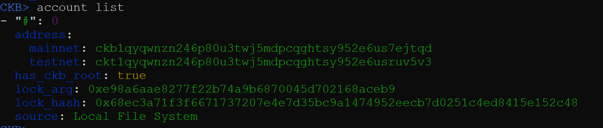
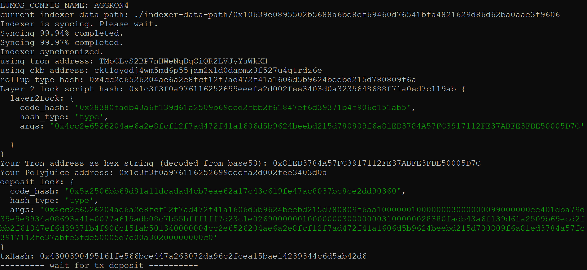
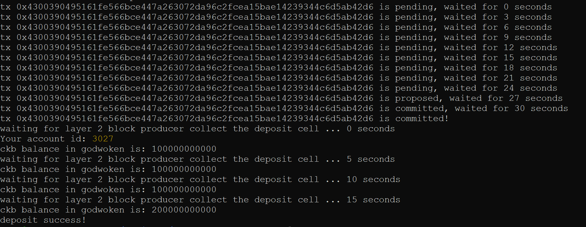
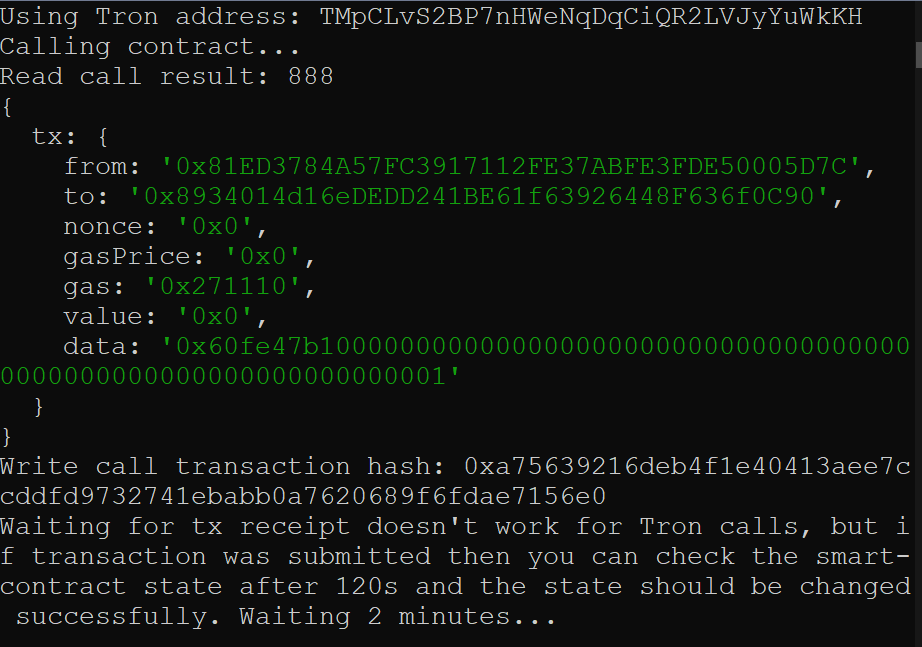
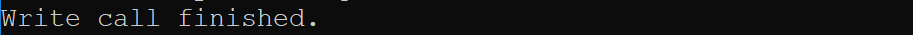
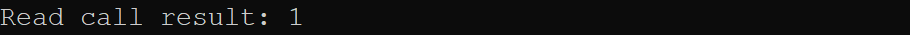

### Screenshot of accounts in ckb-cli



### Layer 1 address on the Testnet Explorer
https://explorer.nervos.org/aggron/address/ckt1qyqg5t92c83vdckls56rlc9y0qccl42mnamszcf36j

### Screenshot of deposit to L2 Tron Account


### Screenshot of smart contract calls




### Contract call transaction hash
0xa75639216deb4f1e40413aee7ccddfd9732741ebabb0a7620689f6fdae7156e0

### Contract address
0x8934014d16eDEDD241BE61f63926448F636f0C90

### Contract ABI
```json
[
  {
    "inputs": [],
    "stateMutability": "payable",
    "type": "constructor"
  },
  {
    "inputs": [
      {
        "internalType": "uint256",
        "name": "x",
        "type": "uint256"
      }
    ],
    "name": "set",
    "outputs": [],
    "stateMutability": "payable",
    "type": "function"
  },
  {
    "inputs": [],
    "name": "get",
    "outputs": [
      {
        "internalType": "uint256",
        "name": "",
        "type": "uint256"
      }
    ],
    "stateMutability": "view",
    "type": "function"
  }
];
```

### Tron Address
TMpCLvS2BP7nHWeNqDqCiQR2LVJyYuWkKH