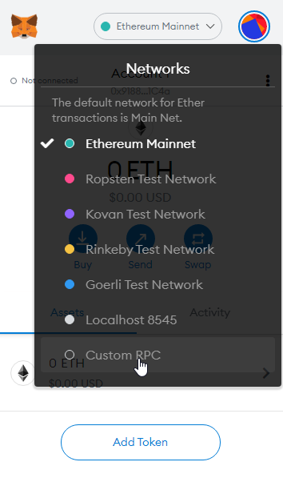

# Document Porting An Existing Ethereum DApp To Polyjuice
## Introduction

Polyjuice is a layer 2 solution that provides a Web3 compatible interface on top of Nervos CKB.

##   1.  Setup the Godwoken Testnet Network in MetaMask

First of all, you have to have a metamask extension wallet in your browser.
Recommended  Google Chrome can directly support it.
Create a wallet or import an existing eth wallet. I believe that this metamask plugin wallet has been used in the previous tasks.
This   is mainly to Add New RPC Network to MetaMask：




    Network Name: Godwoken Test Network
    New RPC URL: https://godwoken-testnet-web3-rpc.ckbapp.dev/
    Chain ID: 71393
    Currency Symbol (optional): N/A
    Block Explorer URL (optional): N/A

You can now interact with a Polyjuice-powered DApp, but first you have to build one.

##   2. Get the Ethereum DApp

From here:
https://github.com/Dex68/nervos_gitcoin/tree/main/task7/Multiplied_by_1000

Open your local server side and enter the command：


    cd ~/projects/Multiplied_by_1000
    
    yarn
    yarn build
    yarn start:ganache
    


Open another command output window under the current path,enter the command:


    yarn ui
  

now open a browser tab to http://localhost:3000 to view the dApp UI.


##   3. Install & Import Polyjuice Dependencies


 @polyjuice-provider/web3, is a custom Polyjuice web3 provider to use instead of the web3 library. It is required for interaction with Nervos Layer 2 smart contracts.

nervos-godwoken-integration, is a tool that can generate a Polyjuice address based on your Ethereum address. You might be required to use it if you store values mapped to addresses in any of your smart contracts.

Install both using the follow commands:

    yarn add @polyjuice-provider/web3@0.0.1-rc7 nervos-godwoken-integration@0.0.6

 Now, you can properly configure your existing DApp for Polyjuice.
 
 Next, we add the following lines in the main dependency importation section of the file.

```
import { PolyjuiceHttpProvider } from '@polyjuice-provider/web3';
import { CONFIG } from '../config';

```

##   4. Edit the Polyjuice Web3 Provider Configuration

Next, create a new configuration file `config.ts` and input the following values for it:


    export const CONFIG = {
    WEB3_PROVIDER_URL: 'https://godwoken-testnet-web3-rpc.ckbapp.dev'
    ROLLUP_TYPE_HASH: '0x4cc2e6526204ae6a2e8fcf12f7ad472f41a1606d5b9624beebd215d780809f6a'
    ETH_ACCOUNT_LOCK_CODE_HASH: '0xdeec13a7b8e100579541384ccaf4b5223733e4a5483c3aec95ddc4c1d5ea5b22'
}


The web3 provider URL should be configured to the same URL you used for the RPC network added to MetaMask.

The rollup_type_hash and eth_account_lock are values that are also required for the configuration file.

##   5.  Replace our dapp Dependencies


    
    
  now we need to add PolyjuiceHttpProvider to our DApp to utilize it for our web3 instance instead of web3.js.

    const godwokenRpcUrl = CONFIG.WEB3_PROVIDER_URL;
    const providerConfig = {
    rollupTypeHash: CONFIG.ROLLUP_TYPE_HASH,
    ethAccountLockCodeHash: CONFIG.ETH_ACCOUNT_LOCK_CODE_HASH,
    web3Url: godwokenRpcUrl
    };
    const provider = new PolyjuiceHttpProvider(godwokenRpcUrl, providerConfig);
    const web3 = new Web3(provider);
    

With the above code, we have replaced our old Ethereum web3 instance with our new, shiny Polyjuice web3 instance.

After this  , your DApp is now capable of communicating with Polyjuice!


##   6. Set Higher Gas Limit
 
 Open the file and update this file,

     cd ~/projects/blockchain-upload-image/src/lib/contracts
    vi SimpleStorageWrapper.ts  
    const DEFAULT_SEND_OPTIONS = {
    gas: 6000000
    };
 
You create a simple object that changes the gas property used by the MetaMask extension to modify objects passed through the send() function.

The modified version of this file in my dapp is:

     this.contract.methods.awardItem(fromAddress, imgUrl).send({
            ...DEFAULT_SEND_OPTIONS,
            from: fromAddress
        });


##   7. Display Polyjuice Address Display in DApp's UI

Every Ethereum address can be translated into a Polyjuice address at layer 2 of Nervos We will use the nervos-godwoken-integration  `AddressTranslator` class to derive a Polyjuice address from an Ethernet address:

     const addressTranslator = new AddressTranslator();

    const polyjuiceAddress = addressTranslator.ethAddressToGodwokenShortAddress(ethereumAddress);

now, you can implement this Polyjuice Address in the user interface (UI) of your DApp.


##   8. View the Completed Your Updated DApp

Run in a browser and is interactable with the MetaMask Wallet extension as soon as you switch its' network to the Godwoken Test network ,Refer to our second   to start the dapp 

    yarn ui

finally enter the URL in your browser to view http://localhost:3000/

