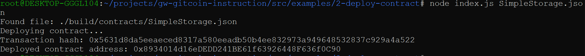

<h2>2. Deploy a Simple Ethereum Smart Contract on Polyjuice</h2>

<h3>Task Submission</h3>

- A screenshot of the console output immediately after you have successfully deployed a smart contract.

- The transaction hash from the contract deployment (in text format).

  <b>0x5631d8da5eeaeced8317a580eeadb50b4ee832973a949648532837c929a4a522</b>      
   
- The deployed contract address from the contract deployment (in text format).

<b>0x8934014d16eDEDD241BE61f63926448F636f0C90</b>
