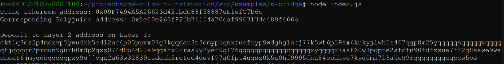

# Gitcoin: 6) Use Force Bridge to Deposit Tokens From Ethereum to Polyjuice

## 1. A screenshot of the console output immediately after you have successfully generated your Deposit Receiver Address.

## 2. Your Deposit Receiver Address (in text format).

  <b>ckt1q3dz2p4mdrvp5ywu4kk5edl2uc4p03puvx07g7kgqdau3n3dmypkqnxzuefxyp9wdghglncj77k5wt6p59sx6kukyjlwh5s467qgp8m25yqqqqqsqqqqqvqqqqqfjqqqqr2prcun9gurh0mdp2qxz074d8p4d23s9qgahv0zras9y2yet9ql76gqqqqpqqqqqqcqqqqqxyqqqqx7asf60w8pqpte2sfcfn90fdfzxue7ff2g8sawe9wacnqat6jmygqngqqqqpxv9ejjvgz2u63w3l839aadguh5rgtqd4devf97a0fpt4uqsz0k5z0hf9995fnz84pphhyg7kyg0ms7l3akcq9rqgqqqqqqcqpcw5pe</b>   

## 3. The Ethereum address used to generate the Deposit Receiver Address (in text format).

  <b>0x09F7494A5A26623d421bdC88f58887eE1efC7b6c</b>   

## 4. A link to the Etherscan explorer for the successful Force Bridge transaction. This can be found on Force Bridge under History→Succeed.

https://rinkeby.etherscan.io/tx/0x6029e220369db144b3e9b7529b656720e537edb61070d12a873ad2df040c78f7

## 5 A link to the Nervos explorer for the successful Force bridge transaction. This can be found on Force Bridge under History→Succeed.

https://explorer.nervos.org/aggron/transaction/0x2ddfed90dc9d078d0b75737af9bd30f9eda4066456a5e539470b64e6e14fe6a5
