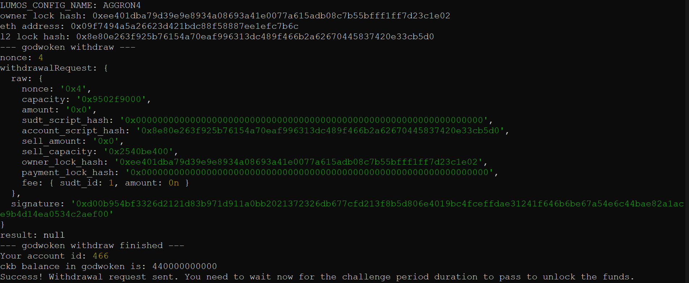

# Gitcoin: 9) Use Force Bridge to Deposit Tokens From Ethereum to Polyjuice

## 1. A screenshot of the console output immediately after running the withdraw command.

## 2. The Ethereum address that you've used for your Layer 2 account (in text format).

   <b>0x09f7494a5a26623d421bdc88f58887ee1efc7b6c/b>   

## 3. The Nervos Layer 1 address that you passed to withdraw command (in text format).

  <b>ckt1qyqdj4wm5md6p55jam2xld0dapmx3f527u4qtrdz6e</b>   
